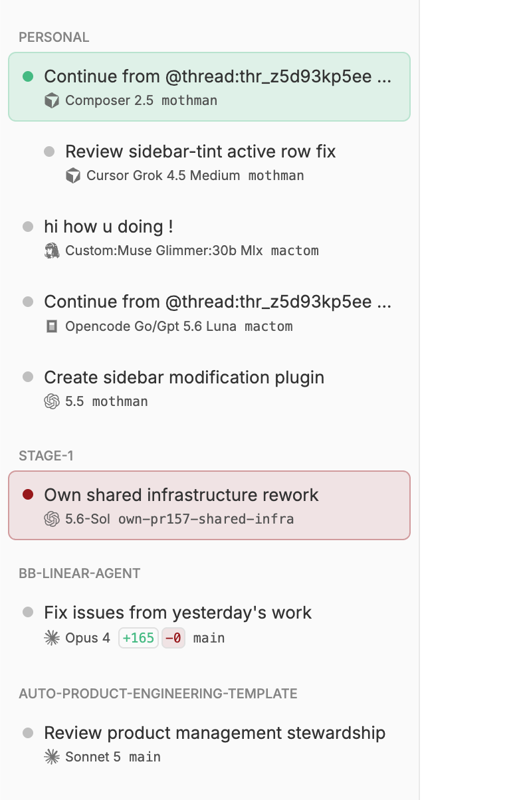

# bb-plugin-tinted-threads

A bb plugin that contributes a replacement sidebar thread list named
`Tinted Threads`.



Rows group by project (or flat), use a red hue when a thread is blocked on
input or failed, and use a subtle green hue while work is active. Sub-threads
render directly beneath their parent with a simple depth indent. Right-clicking
a row opens a thread actions menu, including **Open pull request** when one
exists.

Configure the list under **Extensions → Plugins → Tinted Threads**:

- **Group by** — `project` or `none`
- **Pinned threads** — keep pins inside each group (`in-group`) or in a
  cross-project section at the top (`at-top`)
- **Sort by** — created, updated, attention, or title
- **Show archived child threads** — nested archived sub-threads under a visible
  parent
- **Subtitle columns** — provider/model, uncommitted diff (off by default), PR
  status, and workspace label mode (branch, worktree, host, or smart fallback)

## Use

Install or reload the local plugin:

```sh
npm install --include=dev --cache .npm-cache
bb plugin install . --yes
bb plugin reload tinted-threads
```

Then select `Tinted Threads` in Settings → Appearance → Sidebar.

## Verify

```sh
npm test
npx tsc --noEmit
bb plugin build .
bb plugin list
```
