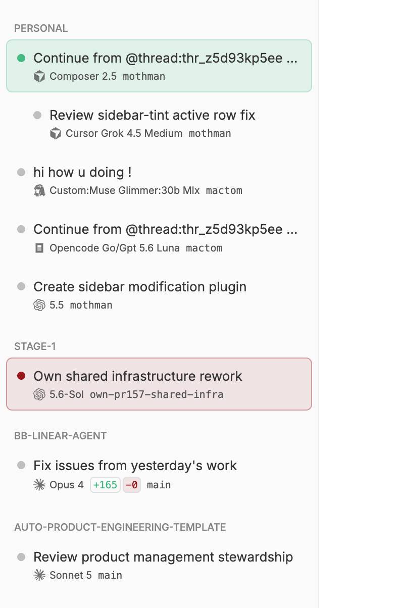

# bb-plugin-tinted-threads

Tinted Threads is bb's own sidebar thread list with extra detail on every row.
You can see at a glance which threads need you and which ones are working.



Since version 0.6.0, Tinted Threads is a fork of the thread list that ships
with bb (`plugins/thread-list`). You get every feature of the stock sidebar,
and Tinted Threads adds its own features on top.

## What you get from bb's sidebar

- Drag a thread to reorder it, nest it under another thread, open it in a
  split, or drop it into the composer.
- Archive a thread with the button on its row.
- Rename a thread inline, and use the full thread actions menu.
- Create your own sections with **New section** in the list menu.
- Organize the list by project, by machine, or into custom sections, and
  optionally group threads by environment.
- Keep pinned threads together in a **Pinned** section at the top, or leave each
  one inside its own group, under **Organize → Pinned**.
- Sort by updated time, created time, or title, and filter active and
  archived threads.
- bb syncs your sections, order, and collapsed rows across devices.

## What Tinted Threads adds

- **Status tints.** A row turns red when the thread needs you, e.g., it is
  waiting for input or it failed. A row turns green while work is running,
  including background agents, background commands, workflows, plan mode, and
  goals.
- **Sub-thread counts.** A parent row shows how many sub-threads it has inside
  its expand button, e.g., `[6 ›]`. The button is green when a sub-thread is
  working and red when a sub-thread needs you. Hover the number to see the
  count for each status.
- **Subtitles.** A second line under each title can show the model, the
  project, the workspace (branch, worktree, or host), and the uncommitted diff.
  You can turn each part on or off under **Display**.
- **Pull request status.** A thread with a pull request shows its state at the
  right edge of the row, with a mark when checks fail or a review is waiting,
  and the lines added and removed on the branch.
- **Density.** Choose **Default**, **Comfortable**, or **Compact** row spacing
  under **Display → Density**. Compact is the row height of bb's stock sidebar.
- **Hide empty projects.** When the list is organized by project, turn on
  **Organize → Sections → Hide empty** to hide projects that have no threads
  to show. The project you are in always stays visible.
- **More room for titles.** The row keeps less empty space on the right, so
  titles are cut off later.

## Install

```sh
bb plugin install git:https://github.com/grrowl/bb-tinted-threads.git
```

Then choose **Tinted Threads** in Settings → Appearance → Sidebar.

Tinted Threads 0.6.0 needs bb 0.44.0 or later.

You can also read and change the list's settings from the command line with
`bb tinted-threads prefs list`.

## How it is built

The fork is developed on the `tinted-threads` branch of
[grrowl/bb](https://github.com/grrowl/bb). Tinted Threads' own code is in new
files under `app/tinted/`, `tinted-server.ts`, and
`shared/tinted-preferences.ts`. Changes to bb's own files are kept small, so
the fork can follow new bb releases with a rebase.
`scripts/tinted-threads/export.mjs` on that branch copies the plugin into this
repository.

The row status comes from the thread data that bb already sends to the
sidebar, so it needs no extra requests. The subtitle and pull request details
are fetched only for rows on screen. The plugin sends these lookups in
batches, one request at a time, and caches the results.

## Develop

```sh
npm install
npx tsc --noEmit
npm test
bb plugin build .
bb plugin install . --yes
```

Make changes on the fork branch, not in this repository, because the export
script replaces these files.

## License

MIT. Tinted Threads is based on bb's thread list plugin. See
[LICENSE](LICENSE) and [NOTICE.md](NOTICE.md).
